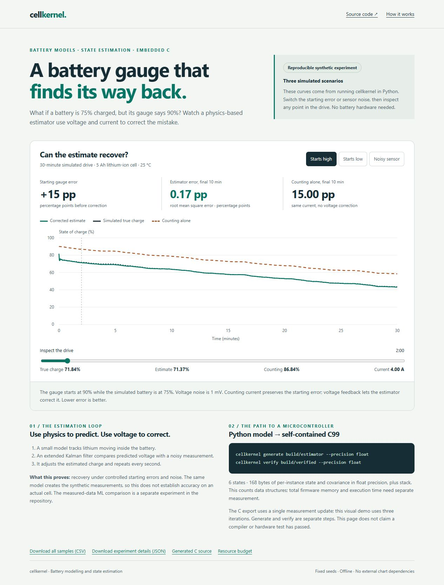

# cellkernel

**Understand a battery. Estimate its charge. Turn the model into C.**

A battery's remaining charge cannot be read directly from a sensor. Software
has to estimate it from measurements such as voltage and current — and correct
it when the starting estimate is wrong.

cellkernel is an open-source Python project for exploring that problem. It
combines **battery physics, state estimation, a measured-data ML benchmark, and
embedded C code generation**, with reproducible experiments at each stage.

**[Try the demo](#try-it-in-five-minutes) · [Physics + ML results](docs/BENCHMARK.md) · [Engineering details](docs/ENGINEERING.md) · [Use your own cell](docs/SOP.md)**



## Start with a simple question

**If a battery is 75% charged but its gauge says 90%, can the software recover?**

The interactive demo answers that using the actual Python model. Switch between
a starting estimate that is too high, one that is too low, and a noisier voltage
sensor. Inspect the charge estimate at any point in the drive, or download the
underlying measurements and results.

In the default synthetic experiment, the estimator reduces a **15-percentage-point
starting error to 0.17 percentage points RMS over the final ten minutes**.
Simply counting current keeps the original 15-point error.

This demonstrates recovery in simulation. The same model generates the synthetic
measurements, so it does **not** establish accuracy on a real battery.

## Try it in five minutes

Use Python 3.10 or newer. Install from this repository so the new commands are
available; no package-index release is assumed.

```bash
git clone https://github.com/harisankarsuresh/cell_kernel.git
cd cell_kernel
python -m venv .venv
```

Activate the environment:

```powershell
# Windows PowerShell
.venv\Scripts\Activate.ps1
```

```bash
# macOS / Linux
source .venv/bin/activate
```

Then install and run:

```bash
python -m pip install -e .
cellkernel demo --open
```

The demo writes `build/demo/index.html` and opens it in your browser. It works
offline after installation, with no web server, account, GPU, C compiler, or
downloaded battery dataset. If the browser does not open, open that file manually.

If PowerShell blocks activation, run `.venv\Scripts\python.exe -m pip install -e .`
and `.venv\Scripts\python.exe -m cellkernel.cli demo --open` instead.

## What you can do

| You want to… | Start here |
|---|---|
| Watch a battery-charge estimate recover | `cellkernel demo --open` |
| Compare physics, machine learning, and a hybrid on measured data | `cellkernel benchmark` — dataset setup below |
| Generate a small C estimator | `cellkernel generate build/estimator --precision float` |
| Compile the generated C and compare it with Python | `cellkernel verify build/verified --precision float` — needs gcc or clang |
| Simulate a drive and export measurements | `cellkernel simulate --out drive.csv` |
| Explore temperature-dependent charging limits | `cellkernel charge --temperature 263.15 298.15` — kelvin: −10 °C and 25 °C |
| Calibrate the model for another battery | [Step-by-step cell procedure](docs/SOP.md) |

Run `cellkernel --help` or `cellkernel <command> --help` for options.

## Where machine learning helps — and where it doesn't

The new benchmark compares three ways of predicting measured battery voltage:

1. **Physics:** a small battery model calibrated using a separate slow-voltage record.
2. **Data only:** ridge regression, a regularised linear model using current and charge-related features.
3. **Hybrid:** the physical prediction plus a learned correction to its voltage error.

The regressions train on complete **0.1C and 1C discharge curves at 25 °C**.
Complete 0.5C and 2C curves are reserved for testing. Neighbouring time samples
are never randomly split between training and testing.

| Held-out discharge | Physics | Data only | Hybrid |
|---|---:|---:|---:|
| 0.5C: inside the training-rate range | 70.48 mV | 72.86 mV | **34.02 mV** |
| 2C: above the training-rate range | **63.30 mV** | 88.71 mV | 95.80 mV |

*Voltage RMSE; lower is better. One measured LG M50 dataset, at one ambient
temperature. C-rate expresses current relative to capacity: 1C is 5 A for a 5 Ah cell.*

The learned correction helps at 0.5C and hurts at 2C. **A better training fit
does not guarantee a better prediction outside the training range.** Both results
are part of the project, with saved predictions and data fingerprints.

Reproduce them:

```bash
python -m cellkernel.data.reference
cellkernel benchmark
```

The first command downloads the external PyBOP dataset into `_data/`. The second
writes `build/benchmark/metrics.json` and `predictions.csv`. Read the
[experiment report](docs/BENCHMARK.md) for calibration, split, limitations, and
the distinction between voltage prediction and charge estimation.

## From an experiment to embedded code

The core workflow is:

```text
Cell parameters + current → Python battery model → Charge estimator
                                      ↓
                            Generated C99 + memory budget
                                      ↓
                        Compile and replay against Python
```

The generated estimator has fixed-size arrays and no dynamic memory allocation.
The default six-state, single-precision version needs **168 bytes per instance
for its state and covariance**, plus stack and other firmware memory. That is
data-structure accounting, not a measurement of total firmware RAM.

The same version cross-compiles to **4,636 bytes of flash on Cortex-M4F** at
`-Os`, and uses **5,086 instructions per filter step in QEMU**. These are
compiler and emulator measurements; timing on a physical board is still needed.

Verification separates arithmetic differences in the generated code from the
approximation introduced by voltage lookup tables. The [engineering reference](docs/ENGINEERING.md)
explains those checks and independent PyBaMM comparisons. The current
[verification record](docs/VALIDATION.md) includes the repeated ARM measurements.

**Scope matters:** C export supports the basic single-particle model and a version
that takes measured temperature. The electrolyte model's C export is unfinished
and raises a clear error. The ML correction is an offline experiment, and the
three-iteration Python demo is not the single-update generated C estimator.

## What's inside

| Area | What it demonstrates | Code |
|---|---|---|
| Battery modelling | Diffusion, voltage, electrolyte and temperature effects | [models](src/cellkernel/models), [reduced models](src/cellkernel/rom) |
| State estimation | Correcting hidden battery states from noisy measurements | [estimators](src/cellkernel/estimators) |
| Parameter fitting | Calibration and checking which parameters data can identify | [identify.py](src/cellkernel/identify.py) |
| Applied ML | Baselines, curve-level holdouts, residual learning, failure analysis | [benchmark.py](src/cellkernel/benchmark.py) |
| Embedded software | C generation, memory accounting and numerical verification | [codegen](src/cellkernel/codegen), [verify](src/cellkernel/verify) |
| Reproducibility | Deterministic demos, exported results and automated checks | [demo.py](src/cellkernel/demo.py), [tests](tests) |

**Plain-language glossary:** state of charge (SoC) means remaining charge as a
percentage; SPM is a simplified physical model of the two electrodes; EKF is an
extended Kalman filter, which updates an estimate using noisy measurements;
RMSE measures typical prediction error; a percentage point is the difference
between two percentages, such as 90% − 75% = 15 points.

## Development and checks

```bash
python -m pip install -e ".[dev]"
python -m pytest
python -m ruff check src tests examples
python -m ruff format --check src tests examples
```

Some tests need extra tools or data and skip when those are missing: gcc/clang
for compiled C, PyBaMM for an independent model comparison, the measured dataset,
and the ARM toolchain/QEMU for embedded measurements. A passing run with skips
does not mean those integrations were tested. See [VALIDATION.md](docs/VALIDATION.md)
for the verification record for this update.

Examples run from the repository root. Start with
[charge estimation](examples/02_estimate_state_of_charge.py),
[a measured-cell comparison](examples/10_against_a_real_cell.py), or
[the complete calibration walkthrough](examples/12_new_cell_walkthrough.py).

## Project status

This is research software for battery modelling and estimation. Cell-specific calibration,
unseen-cell validation and measurements on physical hardware remain necessary
before considering a production application. Thermal and ageing parameters have
documented limitations; model-based charging limits are not a safety certification.

Near-term work: validate the ML correction on additional cells and temperatures,
complete electrolyte-model C export, and measure execution time on a physical board.

Maintained by **Harisankar Suresh**. For bug reports, reproducibility questions,
or proposed improvements, [open an issue](https://github.com/harisankarsuresh/cell_kernel/issues).

BSD 3-Clause license. See [LICENSE](LICENSE).
