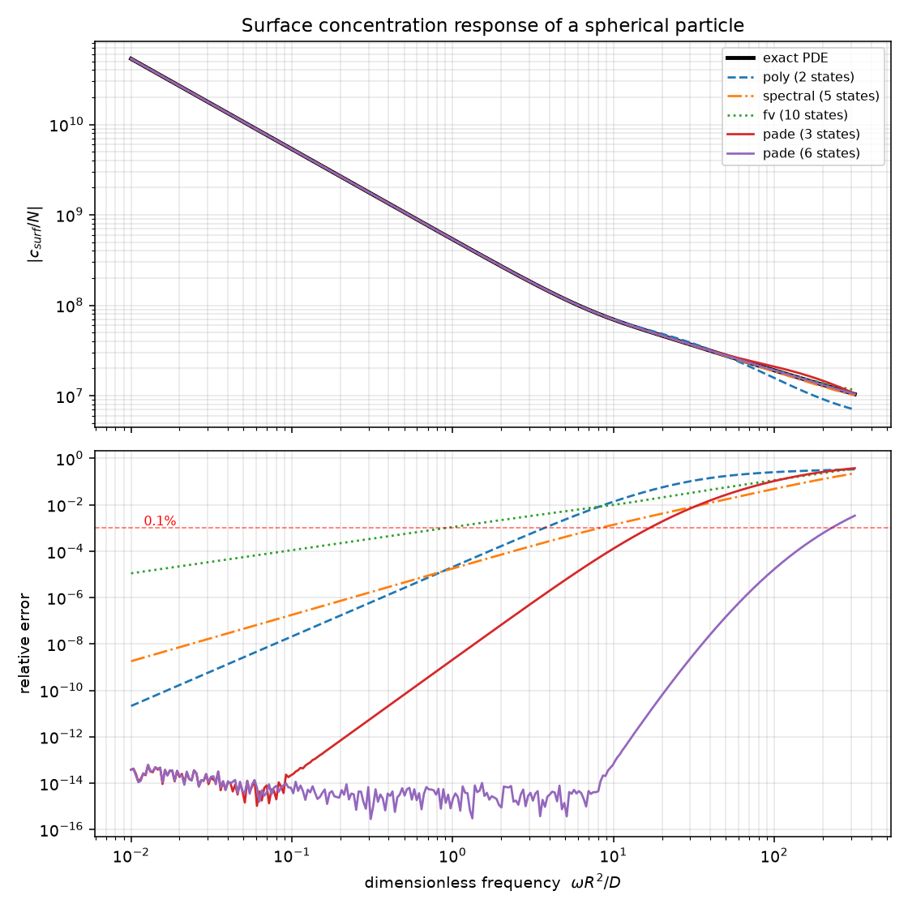
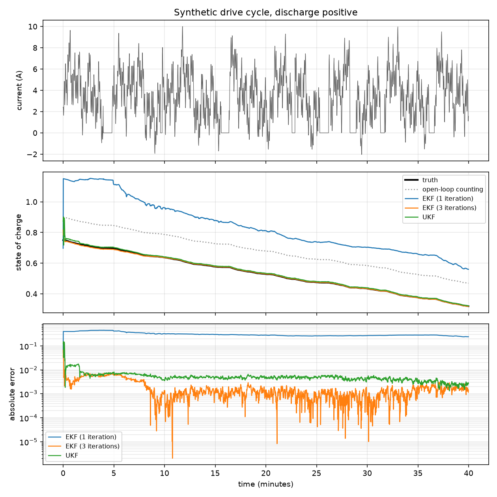

# cellkernel

**Physics-based lithium-ion state estimation, from reduced-order electrochemistry to verified embedded C.**

`cellkernel` takes a physics-based cell model, wraps it in a Kalman filter, and emits a self-contained C99 estimator that runs on a battery-management microcontroller — then compiles that C, replays it against the Python original, and tells you exactly how far apart they are.

On a Cortex-M-class target, a 6-state single particle model with an extended Kalman filter costs **168 bytes of RAM, 2.6 kB of flash, and about 16 µs per step at 120 MHz**. The generated C agrees with the Python reference to **9e-16 V in double precision** and **7 µV in single precision**.

```
verification PASS  (double, 6 states, 900 samples, openloop, gcc)

  code generation fidelity
    generated C vs NumPy mirror, voltage   8.882e-16 V
    generated C vs NumPy mirror, SoC       0.000e+00
    mirror vs table-backed model, voltage  3.997e-15 V

  deliberate approximation
    lookup table vs analytic fit, voltage  6.120e-05 V  (0.061 mV)

  end to end
    generated C vs full Python model       6.120e-05 V  (0.061 mV)
```

## Why this exists

The open-source battery modelling ecosystem is strong and getting stronger. [PyBaMM](https://github.com/pybamm-team/PyBaMM) simulates continuum models beautifully. [PyBOP](https://github.com/pybop-team/PyBOP) identifies their parameters. [cellpy](https://github.com/jepegit/cellpy) and [BEEP](https://github.com/TRI-AMDD/beep) read cycler files. All of them stop at the Python boundary.

But a battery-management unit does not run Python. Getting a physics-based estimator onto the microcontroller that actually controls a pack is, today, a hand translation: someone reads the equations, writes C, and hopes. That translation is where the errors go in, it is unverifiable after the fact, and it is the single biggest reason production systems still ship equivalent-circuit models with coulomb counting while the electrochemistry stays in a research notebook.

`cellkernel` closes that gap and, just as importantly, *measures* it.

## Install

```bash
pip install cellkernel            # runtime: numpy, scipy
pip install cellkernel[dev]       # plus pytest, ruff, matplotlib
```

Python 3.10 or newer. A C compiler (gcc or clang) is needed only to *verify* generated code, not to generate it.

## Five minutes

Compare the reduced-order diffusion models against the exact solution of the sphere problem:

```bash
cellkernel roms
```

```
  model          states       <=1e0       <=1e1       <=1e2
  ---------------------------------------------------------
  pade                3    2.12e-09    1.30e-04    1.06e-01
  pade                5    3.82e-14    1.98e-10    5.72e-04
  spectral            5    1.80e-05    1.39e-03    4.87e-02
  fv                  5    4.41e-03    4.00e-02    4.33e-01
  poly                2    2.10e-05    1.37e-02    2.56e-01
```

Generate an estimator, compile it, and check it:

```bash
cellkernel verify build/estimator --precision float
```

Or from Python:

```python
from cellkernel.codegen import generate
from cellkernel.data import synthetic_drive_cycle
from cellkernel.estimators import EKF
from cellkernel.models import SPM
from cellkernel.params import chen2020_nmc811_graphite
from cellkernel.verify import verify

cell = chen2020_nmc811_graphite()
model = SPM(cell, dt=1.0, rom="pade", order=3)

# Filter a record.
current = synthetic_drive_cycle(cell.nominal_capacity, duration=1800.0)
truth = model.simulate(current, soc0=0.8)

ekf = EKF(
    model,
    process_noise=EKF.suggest_process_noise(model, current_std=0.05),
    measurement_noise=1e-6,
    initial_covariance=EKF.suggest_initial_covariance(model, soc_std=0.1),
    iterations=3,
)
ekf.initialise(0.65)                       # deliberately wrong by 15%
result = ekf.run(current, truth["voltage"])

# Ship it.
project = generate(model, "build/estimator", precision="float")
print(verify(project, model, current).summary())
```

## How it works

Five layers, each usable alone.

### 1. Solid diffusion, reduced

Lithium diffusion in a spherical particle has the exact surface transfer function

```math
G(s) = \frac{R}{D} \cdot \frac{\sinh\xi}{\xi\cosh\xi - \sinh\xi},
\qquad \xi = R\sqrt{s/D}
```

which factors into an integrator carrying the mass balance and an analytic remainder:

```math
G(s) = \frac{3}{Rs} \cdot \hat{H}\left(\frac{R^2 s}{D}\right),
\qquad
\hat{H}(a) = 1 + \frac{a}{15} - \frac{a^2}{525} + \frac{2a^3}{23625} - \cdots
```

Four families approximate it. All are delivered as discrete-time state-space systems, all keep the volume-averaged concentration as an exact state, and all are compared against closed-form results in the test suite:

| Model | States | Character |
|---|---|---|
| `PadeDiffusion` | *k* | Best accuracy per state. Coefficients solved in exact rational arithmetic. |
| `SpectralDiffusion` | *k*+1 | Diagonal state matrix, so the cheapest to evaluate. |
| `FiniteVolumeDiffusion` | *k* | The only one that keeps a resolved interior profile. |
| `PolynomialDiffusion` | 2 | Cheapest that still gets the steady-state surface offset exactly. |



The lower panel is the one that matters. A 6-state Padé model tracks the exact transfer function at machine precision out to $\omega R^2/D \approx 100$, roughly a 10 second timescale for this particle, while a 10-shell finite-volume discretisation is already at 0.1% error in the quasi-static limit — its error is set by spatial resolution, not by bandwidth, so it does not improve as the excitation slows. Reproduce with `python examples/01_compare_reduced_order_models.py`.

Two details do most of the work:

**Discretisation happens offline, by matrix exponential.** A hand-written embedded diffusion solver usually steps explicitly, which is stable only for $\Delta t \lt \Delta r^2 / 2D$ — for a 6 µm particle that is milliseconds, far below a battery-management task period. Exponentiating the generator once, at build time, makes the online update a single dense matrix-vector product that is *unconditionally stable and exact for piecewise-constant current*. All the hard numerics move to the host.

**Padé coefficients are solved in exact rationals.** The Padé linear system is a Hankel matrix built from series coefficients spanning many orders of magnitude ($1$, $\tfrac1{15}$, $-\tfrac1{525}$, $\tfrac2{23625}$, $-\tfrac{37}{9095625}$, …). Solved in double precision it loses significant digits by order 5 and is unusable by order 8. Solved over `fractions.Fraction` it is exact at any order, and it happens once.

### 2. Cell parameters that are actually consistent

A parameter set is only physically meaningful if the electrodes are **charge balanced**: sweeping state of charge from 0 to 1 must move the same lithium out of one electrode as into the other. Quoting electrode loadings and stoichiometry limits independently — as data sheets and papers do — almost always leaves a percent-level imbalance, which then contaminates any transport parameter fitted against the same data.

`balanced_stoichiometry_window` solves four unknowns against four constraints (both electrodes pass exactly the rated capacity; the open-circuit voltage hits both limits) as a bounded least-squares problem. The built-in sets come out balanced to machine precision:

```
nmc811-graphite-5Ah
   usable neg 5.00000 Ah   pos 5.00000 Ah   balance err 0.00e+00
   OCV(0)=2.50000  OCV(1)=4.20000
```

### 3. Cell models with exactly linear dynamics

`SPM` is two particles with reduced-order diffusion and symmetric Butler-Volmer kinetics:

```math
V = U_p(x_p) + \eta_p - U_n(x_n) - \eta_n - I R_c
```

```math
\eta_k = \frac{2RT}{F} \cdot \mathrm{asinh}\left(\frac{j_k}{2 i_{0,k}}\right)
```

`ECM` is the equivalent-circuit baseline it exists to displace, with each RC branch discretised exactly rather than by forward Euler.

The structural point: **the state dynamics are exactly linear.** Diffusion is linear in flux and flux is linear in current, so all nonlinearity lives in the voltage measurement. An extended Kalman filter on this model has *no linearisation error in its prediction step at all* — the usual complaint about EKFs does not apply, and the covariance propagation stays well behaved indefinitely.

### 4. Estimators

`EKF` (Joseph-form covariance, optional Gauss-Newton iteration), `UKF` (sigma points on the measurement only — for an affine map the unscented transform is exact, so propagating them through the linear process would compute the same numbers more slowly and *less* accurately), and `DualEKF` (adds capacity retention and resistance growth).

Two things here are not decoration:

**Priors are shaped, not isotropic.** "I do not know the state of charge" does not mean every state is independently uncertain — a rested cell has no concentration gradient however full it is. `suggest_initial_covariance` returns a rank-one covariance along the state-of-charge direction plus a small floor; `suggest_process_noise` places a rank-one term along the input column, because a mis-measured ampere cannot produce an arbitrary state disturbance. With an isotropic prior instead, corrections are absorbed by the gradient coordinates rather than the bulk concentration, and the filter fits the voltage while leaving its charge error untouched. In development this showed up as a 4% wander during an hour of rest — exactly when open-circuit voltage should be pinning the estimate down.

**Iterating the measurement update matters more than the filter choice.** Seed a nickel-manganese-cobalt cell at 90% when it is really at 75%: the local `dOCV/dSOC` there is about 0.22 V, but the average slope across the gap is near 1.1 V. A single linearised correction therefore overshoots roughly fivefold and the estimate oscillates instead of settling. Measured on a 40-minute drive cycle:

| Filter | Final state-of-charge error |
|---|---|
| EKF, 1 iteration | 0.241 — diverged |
| EKF, 2 iterations | 0.004 |
| EKF, 3 iterations | 0.0015 |
| UKF | 0.0026 |

The iterated EKF beats the unscented filter here, for a fraction of the cost.



The middle panel shows what a single linearised correction actually does when seeded 15% wrong: it drives the estimate *above 100%* state of charge and then takes the whole cycle to crawl back, ending worse than open-loop coulomb counting. That is the failure mode the table above quantifies, and it is the reason `iterations` defaults to more than one. Reproduce with `python examples/02_estimate_state_of_charge.py`.

### 5. Code generation, and evidence

`generate()` emits `cellkernel_estimator.{h,c}` — no dynamic allocation, no global mutable state, fixed-size arrays, bounded execution time, no iteration, worst case equal to typical case. It compiles under `-std=c99 -Wall -Wextra -Wpedantic -Werror` with no warnings. Alongside it come a host harness, a `Makefile`, a `CMakeLists.txt`, and a `BUDGET.txt`:

```
precision            float (4 bytes/word)
states               6
flash (tables)       2584 B
RAM (per instance)   168 B
stack (predict)      216 B
arithmetic/step      564 mul, 522 add, 12 div, 6 sqrt, 2 log
modelled cycles      1979
estimated time       48 MHz: 41.2 us, 80 MHz: 24.7 us, 120 MHz: 16.5 us, 180 MHz: 11.0 us
```

`verify()` then compiles it and splits the error into three legs, because the aggregate number cannot tell you which one you are looking at:

1. **Generated C against a NumPy mirror** with identical loop order and table evaluation. Any disagreement beyond round-off is a code-generation defect. This is the leg that validates the generator.
2. **Mirror against a table-backed Python model.** Zero by construction; catches a mirror that has drifted.
3. **Table-backed against the full analytic model.** The price of a lookup table — a modelling choice, reported in millivolts rather than left implicit.

A 3 mV gap between generated C and a reference is unremarkable if it is table resolution and alarming if it is arithmetic. Separating the legs is what makes the difference visible. During development this immediately localised a 138 mV discrepancy to a lookup table whose domain was too narrow to cover surface excursion under load.

## Known limitations

Stated plainly, because a tool that hides these is worse than one that does not exist.

- **Isothermal.** Temperature enters kinetics, transport and the reduced-order matrices, but the model is built at one temperature. Use `SPM.at_temperature()` and gain-schedule. Full thermal coupling is on the roadmap; `SpectralDiffusion` is the natural vehicle, since its diagonal state matrix means an Arrhenius change in diffusivity costs one exponential per mode rather than a matrix exponential.
- **No electrolyte dynamics.** This is a single particle model with a lumped series resistance, not SPMe. Electrolyte concentration polarisation is not represented, which matters above roughly 3C and in thick electrodes.
- **The posterior covariance is optimistic at open circuit.** One voltage measurement cannot separate the two electrodes; there is a direction in state space that voltage never observes, and only current integration couples them. The reported standard deviation comes out several times smaller than the true error during long rests. This is asserted as a test rather than hidden, so it will be noticed when fixed.
- **Lookup-table error is not uniform.** Worst-case interpolation error for the built-in graphite fit is 4.95 mV at 257 points, but it is confined entirely below 4% stoichiometry — the steep exponential rise, 3% of the table domain and below the operating window. Median error over the domain is 0.002 mV. Raise `table_points` if the extremes matter; `BUDGET.txt` reports the figure so the trade is explicit.
- **Capacity retention is modelled as loss of active material** (flux scaling), not loss of lithium inventory. That makes it partially observable from pulse transients, which is correct for that mechanism and wrong for the other. Distinguishing them needs a second parameter.
- **Cycle counts are modelled, not measured.** The structural claims — quadratic in state count, dominated by covariance propagation, no iteration — are reliable. The absolute number is a planning figure for a Cortex-M4F.

## Testing

```bash
pytest                      # 236 tests
pytest -m "not compiler"    # skip tests needing a C compiler
```

The test suite is anchored to closed-form results wherever possible rather than to previous outputs. Among the things it asserts:

- the exact series coefficients $1, \tfrac1{15}, -\tfrac1{525}, \tfrac2{23625}, -\tfrac{37}{9095625}$;
- $\sum_k \lambda_k^{-2} = 1/10$ over the roots of $\tan\lambda = \lambda$, *and* that the residual shrinks as $1/\pi^2 k$;
- the steady-state surface offset $RN/5D$ — exactly for the polynomial and residualised spectral models, converging at second order for finite volume;
- that the mass balance is structurally exact for every model at every order;
- that zero-order-hold discretisation is stable at $\Delta t = 100 R^2/D$;
- that a rested cell's terminal voltage equals its open-circuit voltage to 1e-9 V;
- that exchange current density lands in the physically plausible 0.1–30 A m⁻² band, which is the guard that caught a spurious Faraday constant collapsing the kinetic overpotential to microvolts;
- that the unscented transform of the linear process reproduces $APA^\top$, and that tight sigma points lose precision doing so;
- that the generated C matches its mirror to machine precision.

Where a finite-difference reference is used, the step size is chosen adaptively: with a state vector spanning `1e4` to `1e10` a fixed relative step makes the *reference* less accurate than the derivative it is checking, which is a uniquely misleading failure.

## Citing

If this is useful in published work, please cite it. See [`paper/paper.md`](paper/paper.md).

## Licence

BSD 3-Clause. See [`LICENSE`](LICENSE).
