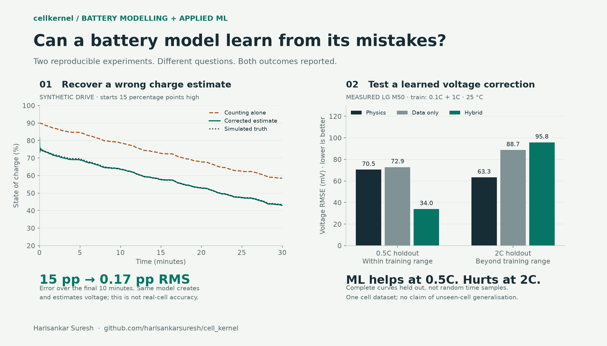

# Does machine learning improve a battery model?

[Back to the overview](../README.md)

**Sometimes. In this experiment, a learned voltage correction helps at an unseen
rate inside the training range and hurts at a faster unseen rate.**

This is a small, transparent baseline for investigating hybrid battery modelling.
It is not a neural network, a state-of-charge estimator, or evidence that machine
learning always improves the physical model.

## Reproduce the experiment

From the repository root, after installing the package:

```bash
python -m cellkernel.data.reference
cellkernel benchmark
```

Outputs are `build/benchmark/metrics.json` (scores, models, method, versions and
SHA-256 data fingerprints) and `build/benchmark/predictions.csv` (every sample).
Use `--data <directory>` for an existing dataset. The benchmark never downloads
data implicitly. A saved [result snapshot](results/benchmark.json) accompanies
this report; regenerate the results if code or data changes.

## What is being predicted?

Terminal voltage throughout a constant-current discharge of an LG M50 lithium-ion
cell. All four recordings have 25 °C ambient temperature. The source records come
from the [PyBOP LG M50 dataset](https://github.com/pybop-team/PyBOP/tree/develop/examples/data/LG_M50_ECM/data)
through cellkernel's existing loader. Raw measurements are downloaded separately
and are not redistributed in this repository.

The initial charge is assumed to be full. SoC features are computed from the
physical model's charge balance driven by recorded current. They are **not
measured ground-truth SoC**, and this experiment does not solve unknown initial
charge. Its prediction target is voltage, unlike the synthetic demo's charge
estimate.

## Fixed experiment design

| Choice | Implementation |
|---|---|
| Calibration | Fit electrode stoichiometry to the separate 25 °C pseudo-OCV record. Derive capacity only from the 0.1C training discharge. |
| Physical baseline | Built-in Chen2020 parameter set, isothermal SPM, Padé order 5 per electrode, 10-second step. No transport fitting to discharge voltages. |
| Training curves | Entire 0.1C and 1C discharges. |
| Test curves | Entire 0.5C and 2C discharges. |
| Features | SoC, SoC², current, current × SoC, current × SoC². |
| Data-only model | Ridge regression predicting measured voltage. |
| Hybrid model | Identical ridge method predicting measured voltage minus physical voltage, added to the physical prediction. |
| Scaling | Feature mean and variance learned from training inputs only; constant features have scale 1. |
| Weighting | Equal total weight per training curve, so the longer 0.1C record does not dominate the objective. |
| Regularisation | Fixed alpha 0.01 with weights normalised to sum to one; intercept is not penalised. No test-set tuning. |
| Scoring | All loader-returned samples of each curve, without residual-based trimming. RMSE, MAE, and maximum absolute error in mV. |

The fitting code has no test targets as inputs. A regression test changes only
held-out voltage labels and checks that fitted coefficients, preprocessing,
training scores and all predictions remain unchanged. Only held-out scores may
change. This guards the experiment against data leakage.

## Results

| Split | Discharge | Physics RMSE | Data-only RMSE | Hybrid RMSE |
|---|---|---:|---:|---:|
| Training | 0.1C | 65.46 mV | 73.76 mV | 27.12 mV |
| Training | 1C | 73.27 mV | 61.15 mV | 24.89 mV |
| Held out | 0.5C | 70.48 mV | 72.86 mV | 34.02 mV |
| Held out | 2C | 63.30 mV | 88.71 mV | 95.80 mV |



Regenerate this figure with `python examples/13_compare_physics_and_ml.py`
after installing `.[plot]` and downloading the dataset.

At 0.5C, the hybrid error is about **52% lower** than the physical baseline.
At 2C, it is about **51% higher**. Both comparisons use the same measured samples
and the same calibrated physical baseline.

The 0.5C result tests interpolation between the training currents. The 2C result
tests extrapolation. A plausible interpretation is that the correction captures
voltage residuals within the observed operating range but does not extrapolate
reliably. This experiment alone cannot establish which physical mechanism causes
the remaining error.

## What the results do not establish

- **Unseen-cell generalisation.** All curves come from one cell dataset. Testing another cell is a different and more demanding experiment.
- **Temperature generalisation.** Only 25 °C ambient records are used, and the isothermal physical model ignores recorded self-heating.
- **Independent sample counts.** Resampled neighbouring points are correlated. Thousands of rows do not mean thousands of independent experiments.
- **A production correction.** These baselines predict voltage offline. The correction is not exported to C and does not control charging.
- **New electrochemical parameters.** A learned residual is a statistical correction, not an identified reaction rate or diffusion coefficient.

The separate OCV record is calibration data from the same cell dataset. That is
appropriate for a *new discharge rate on a calibrated cell* experiment; it would
not be a valid claim of predicting a completely unseen cell without calibration.

The data URLs reference an upstream development branch and may change. Saved
SHA-256 fingerprints identify the exact local source files used in this run.
The older experiments in [ENGINEERING.md](ENGINEERING.md) use different parameter
imports and calibration choices; their values are not directly interchangeable
with this benchmark.

## Next experiment

Freeze this result before adding models. Add separate training, validation and
test groups spanning cells and temperatures; select features and penalties on
validation groups alone. Compare against temperature-aware physical models and
report whether improvements survive those stronger holdouts. A failure to improve
is still an informative result.
